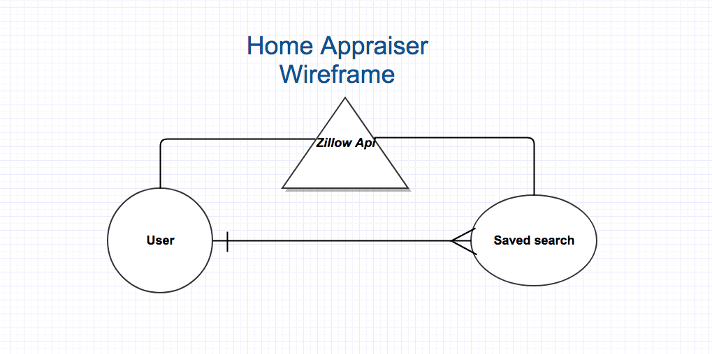

# Home Appraiser


###### This project was bootstrapped with [Create React App](https://github.com/facebookincubator/create-react-app).


## Table of Contents

- [About](#about)
- [Technologies Used](#technologies used)
- [General Approach](#general approach)
- [Installation Instructions](#installation instructions)
- [User Stories](#available-scripts)
- [Wireframes](#adding-flow)
- [Technical Requirements](#technical requirements)
- [Unsolved Problems](#adding-custom-environment-variables)
  - [Major Hurdles](#Major hurdles)


## About
Home appraiser is a fullstack web application using Node.js on the backend and react on the front-end to send Api calls to zillow.com's api service to return an estimated current market value on any given property.


## Technologies Used
- Node.js
- MongoDB
- Express
- React
- Git / Github
- MLab
- Heroku

## General Approach

The approach I took from beginning to end was first to decide on what type of application interest me. Once I had an idea then I brainstormed to see what would be the best way to get the information I needed. I decided to go with a third party api and figured data from zillow would be the best for my site being that their company has millions of listings and in depth information on each.

I set out to finish the backend functionality and user model and routes first since I was most familiar with it.

I then worked on The front-end displaying the information from the back-end and decided to use react since it was a newly taught language and I am interested in learning more about it.

## Installation Instructions
Do a `git clone` of this repositories url in your workspace.
Then do a `git pull`.

## User Stories


## Wireframe



## Api Call


```json
app.post('/api/location', (req,res) => {

  var address = req.body.address
  var citystatezip = req.body.citystatezip
  zillow = new Zillow('zws-id')
  var url = `http://www.zillow.com/webservice/GetDeepSearchResults.htm?zws-id=${zillow.id}&address=${address}&citystatezip=${citystatezip}`

  request(url, function (error, response, body) {
    if(!error && response.statusCode == 200) {
      var jsonResponse = JSON.parse(parser.toJson(body))
     sult[1].zpid

      res.json(jsonResponse)
    }
  })
})
```


## Technical Requirements

- Build a full-stack application by making your own backend and your own front-end
- Have an API of your design
- Have an interactive front-end, preferably using a modern front-end framework
- Be a complete product, which most likely means multiple relationships and CRUD functionality for at least a couple models
- Use a database.

## Unsolved Problems

- I need an api that will return multiple listings and more data.
- need to fine tune the styling.

## Major Hurdles...

# Everything!!!!!
 - The api calls were challenging figuring out exactly the best way to do it with such limited documentstion.
 - Learning the component flow of react and rendering different pages by setting the state.
 - Syntax error: Adjacent JSX elements must be wrapped in an enclosing tag 
